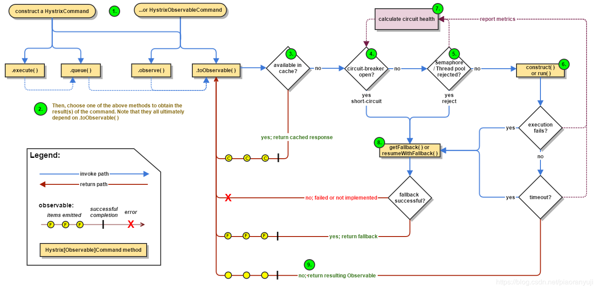

# # Hystrix熔断降级

**Hystrix框架**
## Hystrix框架
### 1、服务的稳定如何去做
1、消除依赖： 梳理去除、隔离。 比如系统尽量减少第三方依赖；核心与非核心业务服务化拆分；服务内各场景线程池级别隔离。

2、弱化依赖： 旁路、缓存。

3、控制依赖： 熔断降级、服务限流、设置合理的超时重试。 避免级连失败。

4、设置合理的超时和重试。

- 首先要调研被依赖服务自己调用下游的超时时间是多少。调用方的超时时间要大于被依赖方调用下游的时间。
- 统计这个接口99%的响应时间是多少，设置的超时时间在这个基础上加50%。如果接口依赖第三方，而第三方的波动比较大，也可以按照95%的响应时间。
- 重试次数如果系统服务重要性高，则按照默认，一般是重试三次。否则，可以不重试。

###  2、Hystrix 解决了什么问题
(1)限制调用分布式服务的资源使用，某一个调用的服务出现问题不会影响其他服务调用，通过线程池隔离和信号量隔离实现。 
(2)Hystrix 提供了优雅降级机制：超时降级、资源不足时（线程或信号量）降级，降级后可以配合降级接口返回兜底数据。 
(3)Hystrix 提供了熔断器实现，当失败率达到阀值自动触发降级（如因网络故障/超时造成的失败率高），熔断器触发的快速失败会进行快速恢复等 
### 3、Hystrix遵循的设计原则
(1)防止任何单独的依赖耗尽资源（线程 
(2)过载立即切断并快速失败，防止排队 
(3) 尽可能提供回退以保护用户免受故障 
(4)使用隔离技术（例如隔板，泳道和断路器模式）来限制任何一个依赖的影响 
(5)通过近实时的指标，监控和告警，确保故障被及时发现 
(6)通过动态修改配置属性，确保故障及时恢复 
(7)防止整个依赖客户端执行失败，而不仅仅是网络通信 
### 4、Hystrix 的工作流程
 
Hystrix 整个工作流如下： 
(1)构造一个 HystrixCommand 或 HystrixObservableCommand 对象，用于封装请求，并在构造方法配置请求被执行需要的参数； 
(2)执行命令，Hystrix提供了多种执行命令的方法（详见下）； 
(3) 判断是否使用缓存响应请求，若启用了缓存，且缓存可用，直接使用缓存响应请求。Hystrix 支持请求缓存，但需要用户自定义启动； 
(4)判断熔断器是否打开（熔断器有3种状态，详见下），如果打开，跳到第8步； 
(5)判断线程池/队列/信号量是否已满，已满则跳到第8步； 
(6)执行 HystrixObservableCommand.construct() 或HystrixCommand.run()，如果执行失败或者超时，跳到第8步；否则，跳到第9步； 
(7)统计熔断器监控指标； 
(8)走Fallback备用逻辑； 
(9)返回请求响应。
从流程图上可知道，第5步线程池/队列/信号量已满时，还会执行第7步逻辑，更新熔断器统计信息，而第6步无论成功与否，都会更新熔断器统计信息。
### 5、Hystrix 执行命令的几种方法
Hystrix 提供了4种执行命令的方法，execute() 和 queue() 适用于 HystrixCommand 对象，而 observe() 和toObservable() 适用于 HystrixObservableCommand 对象。

execute()
以同步堵塞方式执行 run()，只支持接收一个值对象。Hystrix 会从线程池中取一个线程来执行 run()，并等待返回值。

queue()
以异步非阻塞方式执行 run()，只支持接收一个值对象。调用 queue() 就直接返回一个 Future 对象。可通过 Future.get() 拿到 run() 的返回结果，但 Future.get() 是阻塞执行的。若执行成功，Future.get() 返回单个值。当执行失败时，如果没有重写 fallback，Future.get() 抛出异常。

observe()
事件注册前执行 run() / construct()，支持接收多个值对象，取决于发射源。调用 observe() 会返回一个 hot Observable，也就是说，调用 observe() 自动触发执行 run() / construct()，无论是否存在订阅者。

如果继承的是 HystrixCommand，Hystrix 会从线程池中取一个线程以非阻塞方式执行 run()；如果继承的是HystrixObservableCommand，将以调用线程阻塞执行 construct()。

observe() 使用方法：

调用 observe() 会返回一个 Observable 对象；
调用这个 Observable 对象的 subscribe() 方法完成事件注册，从而获取结果。
toObservable()
事件注册后执行 run() / construct()，支持接收多个值对象，取决于发射源。调用 toObservable() 会返回一个 cold Observable，也就是说，调用 toObservable() 不会立即触发执行 run() / construct()，必须有订阅者订阅 Observable 时才会执行。

如果继承的是 HystrixCommand，Hystrix 会从线程池中取一个线程以非阻塞方式执行 run()，调用线程不必等待run()；如果继承的是 HystrixObservableCommand，将以调用线程堵塞执行 construct()，调用线程需等待construct() 执行完才能继续往下走。

toObservable() 使用方法：

调用 observe() 会返回一个Observable对象；
调用这个 Observable 对象的 subscribe() 方法完成事件注册，从而获取结果。
需注意的是，HystrixCommand 也支持 toObservable() 和 observe()，但是即使将 HystrixCommand 转换成Observable，它也只能发射一个值对象。只有 HystrixObservableCommand 才支持发射多个值对象。
### 5、熔断器的三种状态
Hystrix 提供的熔断器具有自我反馈，自我恢复的功能，Hystrix会根据调用接口的情况，让熔断器在closed，open，half-open 三种状态之间自动切换。 
open 状态：说明打开熔断，也就是服务调用方执行本地降级策略，不进行远程调用。 
closed 状态：说明关闭了熔断，这时候服务调用方直接发起远程调用。 
half-open 状态：是一个中间状态，当熔断器处于这种状态时，直接发起远程调用。 

**三种状态的转换：** 
**closed → open**：正常情况下熔断器为 closed 状态，当访问同一个接口次数超过设定阈值并且错误比例超过设置错误阈值的时候，就会打开熔断机制，这时候熔断器状态从 closed → open。

**open → half-open**：当服务接口对应的熔断器状态为 open 状态时候，所有服务调用方调用该服务方法时候都是执行本地降级方法，那么什么时候才会恢复到远程调用呢？Hystrix 提供了一种测试策略，也就是设置了一个时间窗口，从熔断器状态变为 open 状态开始的一个时间窗口内，调用该服务接口时候都委托服务降级方法进行执行。如果时间超过了时间窗口，则把熔断状态从 open → half-open，这时候服务调用方调用服务接口时，就可以发起远程调用而不再使用本地降级接口，如果发起远程调用还是失败，则重新设置熔断器状态为open状态，从新记录时间窗口开始时间。

**half-open → closed**：当熔断器状态为 half-open，这时候服务调用方调用服务接口时候，就可以发起远程调用而不再使用本地降级接口，如果发起远程调用成功，则重新设置熔断器状态为 closed 状态。

**用来判断熔断器从 closed → open:**转换的数据是 HystrixCommandMetrics 对象来做的，该对象用来存HystrixCommand 的一些指标数据，比如接口调用次数，调用接口失败的次数等等。

### 6、Hystrix 几种容错方案
**Hystrix 的容错主要有以下几种方案：**

- 隔离模式（线程池隔离、信号量隔离）
对不同类型的请求使用线程池来资源隔离，每种类型的请求互不影响，如果一种类型的请求线程资源耗尽，则对后续的该类型请求直接返回，不再调用后续资源。
- 熔断模式
如果某个目标服务调用慢或者有大量超时，此时，熔断该服务的调用，对于后续调用请求，不再继续调用目标服务，而是调用降级服务返回数据，快速释放资源。如果目标服务情况好转则恢复调用。
- 限流模式
上述的熔断模式和隔离模式都属于出错后的容错处理机制，而限流模式则可以称为预防模式。限流模式主要是提前对各个类型的请求设置最高的QPS阈值，若高于设置的阈值则对该请求直接返回，不再调用后续资源。这种模式不能解决服务依赖的问题，只能解决系统整体资源分配问题，因为没有被限流的请求依然有可能造成雪崩效应。

**隔离模式一般使用两种：**

- 线程池隔离模式 
使用一个线程池来存储当前的请求，线程池对请求作处理，设置任务返回处理超时时间，堆积的请求堆积入线程池队列。这种方式需要为每个依赖的服务申请线程池，有一定的资源消耗，好处是可以应对突发流量（流量洪峰来临时，处理不完可将数据存储到线程池队列慢慢处理）。
- 信号量隔离模式 
使用一个原子计数器（或信号量）来记录当前有多少个线程在运行，请求来了的话，先判断计数器的数值，若超过设置的最大数值则丢弃该类型的新请求，若不超过则执行计数操作请求，使计数器 +1，请求返回则计数器 -1。这种方式是严格的控制线程且立即返回模式，无法应对突发流量（流量洪峰来临时，处理的线程超过数量，其他的请求会直接返回，不继续去请求依赖的服务）。
### 7、 hystrix实现原理
hystrix语义为“豪猪”，具有自我保护的能力。hystrix的出现即为解决雪崩效应，它通过四个方面的机制来解决这个问题

(1)隔离（线程池隔离和信号量隔离）：限制调用分布式服务的资源使用，某一个调用的服务出现问题不会影响其他服务调用。 
(2)优雅的降级机制：超时降级、资源不足时(线程或信号量)降级，降级后可以配合降级接口返回托底数据。 
(3)熔断：当失败率达到阀值自动触发降级(如因网络故障/超时造成的失败率高)，熔断器触发的快速失败会进行快速恢复。 
(4)缓存：提供了请求缓存、请求合并实现。
支持实时监控、报警、控制（修改配置）

### 8、常见的限流算法

常见的限流算法有：令牌桶、漏桶。计数器也可以进行粗暴限流实现。

计数器方法

系统维护一个计数器，来一个请求就加1，请求处理完成就减1，当计数器大于指定的阈值，就拒绝新的请求。
基于这个简单的方法，可以再延伸出一些高级功能，比如阈值可以不是固定值，是动态调整的。另外，还可以有多组计数器分别管理不同的服务，以保证互不影响等。

漏桶(Leaky Bucket)算法思路很简单,水(请求)先进入到漏桶里,漏桶以一定的速度出水(接口有响应速率),当水流入速度过大会直接溢出(访问频率超过接口响应速率),然后就拒绝请求,可以看出漏桶算法能强行限制数据的传输速率

令牌桶算法(Token Bucket)和 Leaky Bucket 效果一样但方向相反的算法,更加容易理解.随着时间流逝,系统会按恒定1/QPS时间间隔(如果QPS=100,则间隔是10ms)往桶里加入Token(想象和漏洞漏水相反,有个水龙头在不断的加水),如果桶已经满了就不再加了.新请求来临时,会各自拿走一个Token,如果没有Token可拿了就阻塞或者拒绝服务. 

在令牌桶算法中，存在一个桶，用来存放固定数量的令牌。算法中存在一种机制，以一定的速率往桶中放令牌。每次请求调用需要先获取令牌，只有拿到令牌，才有机会继续执行，否则选择选择等待可用的令牌、或者直接拒绝。
