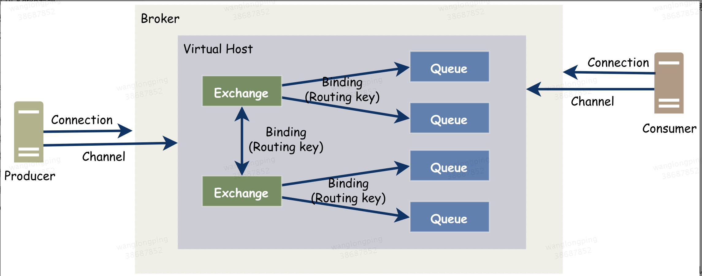
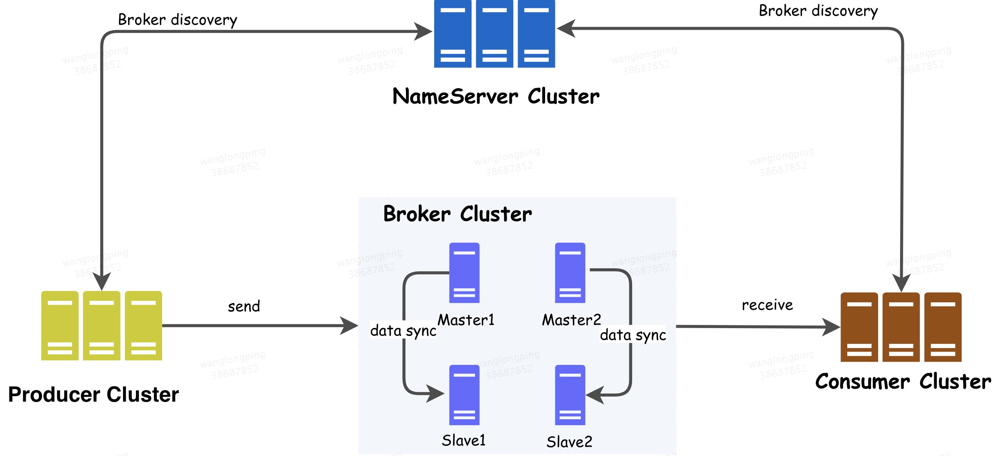
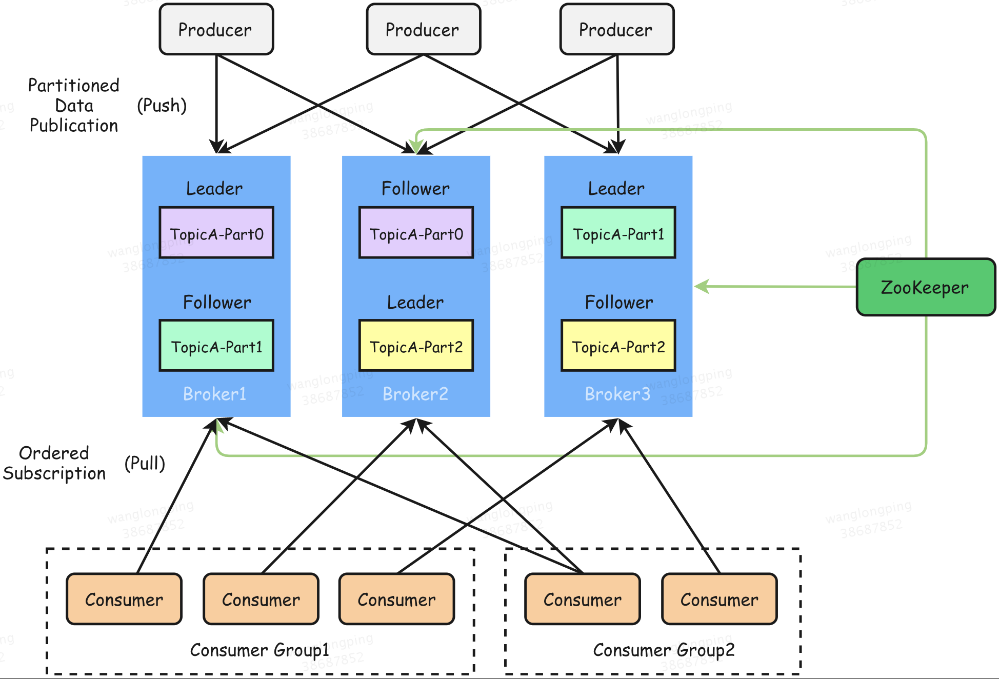

# MQ总结

**MQ面试总结**
## 基础知识面试总结
## 1、为什么使用消息队列？
分析：一个用消息队列的人，不知道为啥用，这就有点尴尬、没有复习这点，很容易被问蒙，然后就开始胡扯了。 
回答：这个问题，咱只答三个最主要的应用场景（不可否认还有掐的，但是只答三个主要的），即以下六个字：解耦、异步、削峰 
## 2、使用了消息队列会有什么缺点？
系统可用性降低：你想呀，本来其他系统只要运行好好的，那你的系统就是正常的。现在你非要加入个消息队列进去，那消息队列挂了，你的系统不是呵呵了。因此，系统可用性会降低 
系统复杂性增加：加入了消息队列，要多考虑很多方面的问题，比如：一致性问题、如何保证消息不被重复消费、如何保证消息可靠性传输等。因此，需要考虑的东西更多，刺痛复杂性增大。 
## 3、消息队列如何选型？
（1）RabbitMQ： 
RabbitMQ是实现AMQP协议(0.9.1)的消息中间件的一种，由RabbitMQ Technologies Ltd开发并且提供商业支持的，最初起源于金融系统，服务器端用Erlang语言编写，用于在分布式系统中存储转发消息，在易用性、扩展性、高可用性等方面表现不俗。 
 
主要特性：

a.可靠性：提供了多种技术可以让你在性能和可靠性之间进行权衡，如持久性机制、投递确认、发布确认和高可用性机制

b.灵活的路由：消息在到达队列之前，通过Exchange进行路由。对于典型的路由RabbitMQ提供了一些内置的Exchange，而对于更复杂的路由，则可以将这些Exchange组合起来使用，甚至可以实现自己的Exchange，并且当做 RabbitMQ的插件来使用

c.消息集群：在相同局域网中的多个 RabbitMQ 服务器聚合在一起，形成一个逻辑 Broker

d.高可用：队列可以在集群中的机器上进行镜像，以确保在硬件问题下还保证消息安全

e.多协议：支持多种消息队列协议, 如 STOMP、MQTT等

f.多语言：使用Erlang语言编写，客户端几乎支持所有常用语言

g.管理界面： RabbitMQ有一个易用的web用户界面，使得用户可以方便的进行监控和消息的管理

h.跟踪机制：RabbitMQ提供消息跟踪机制

i.插件机制：提供了许多的插件来进行扩展，也支持自定义插件的开发
（2）RocketMQ： 
RocketMQ 是阿里巴巴在2012年开源的分布式消息中间件，目前已经捐赠给 Apache 软件基金会，并于2017年9月25日成为 Apache 的顶级项目。作为经历过多次阿里巴巴双十一这种“超级工程”的洗礼并有稳定出色表现的国产中间件，以其高性能、低延时和高可靠等特性近年来已经也被越来越多的国内企业使用。
 

生产者组（Producer）

负责产生消息，生产者向消息服务器发送由业务应用程序系统生成的消息。 RocketMQ 提供了三种方式发送消息：同步、异步和单向。

消费者组（Consumer）

负责消费消息，消费者从消息服务器拉取信息并将其输入用户应用程序。站在用户应用的角度消费者有两种类型：拉取型消费者、推送型消费者。拉取型消费者主动从消息服务器拉取信息，只要批量拉取到消息，用户应用就会启动消费过程，所以 Pull 称为主动消费型。推送型消费者封装了消息的拉取、消费进度和其他的内部维护工作，将消息到达时执行的回调接口留给用户应用程序来实现。所以 Push 称为被动消费类型，但从实现上看还是从消息服务器中拉取消息，不同于 Pull 的是 Push 首先要注册消费监听器，当监听器处触发后才开始消费消息。

名称服务器（NameServer）

用来保存 Broker 相关元信息并给 Producer 和 Consumer 查找 Broker 信息。NameServer 被设计成几乎无状态的，可以横向扩展，节点之间相互之间无通信，通过部署多台机器来标记自己是一个伪集群。每个 Broker 在启动的时候会到 NameServer 注册，Producer 在发送消息前会根据 Topic 到 NameServer 获取到 Broker 的路由信息，Consumer 也会定时获取 Topic 的路由信息。所以从功能上看应该是和 ZooKeeper 差不多，据说 RocketMQ 的早期版本确实是使用的 ZooKeeper ，后来改为了自己实现的 NameServer 。

消息服务器（Broker）

是消息存储中心，主要作用是接收来自 Producer 的消息并存储， Consumer 从这里取得消息。它还存储与消息相关的元数据，包括用户组、消费进度偏移量、队列信息等。从部署结构图中可以看出 Broker 有 Master 和 Slave 两种类型，Master 既可以写又可以读，Slave不可以写只可以读。从物理结构上看 Broker 的集群部署方式有四种：单 Master 、多 Master 、多 Master 多 Slave（同步刷盘）、多 Master多 Slave（异步刷盘）。

主要特性：

a.灵活可扩展性： 天然支持集群，其核心四组件（Name Server、Broker、Producer、Consumer）每一个都可以在没有单点故障的情况下进行水平扩展。

b.海量消息堆积：采用零拷贝原理实现超大的消息的堆积能力，据说单机已可以支持亿级消息堆积，而且在堆积了这么多消息后依然保持写入低延迟。

c.顺序消息：可以保证消息消费者按照消息发送的顺序对消息进行消费。顺序消息分为全局有序和局部有序，一般推荐使用局部有序，即生产者通过将某一类消息按顺序发送至同一个队列来实现。

d.消息过滤：分为在服务器端过滤和在消费端过滤。服务器端过滤时可以按照消息消费者的要求做过滤，优点是减少不必要消息传输，缺点是增加了消息服务器的负担，实现相对复杂。消费端过滤则完全由具体应用自定义实现，这种方式更加灵活，缺点是很多无用的消息会传输给消息消费者。

e.事务消息：除了支持普通消息，顺序消息之外还支持事务消息，这个特性对于分布式事务来说提供了又一种解决思路。

f.消息回溯：是指消费者已经消费成功的消息，由于业务上需求需要重新消费，RocketMQ 支持按照时间回溯消费，时间维度精确到毫秒，可以向前回溯，也可以向后回溯。

（3）kafka： 
Kafka是由Apache软件基金会开发的一个开源流处理平台，由Scala和Java编写。Kafka是一种高吞吐量的分布式发布订阅消息系统，它可以处理消费者规模的网站中的所有动作流数据。 这种动作（网页浏览，搜索和其他用户的行动）是在现代网络上的许多社会功能的一个关键因素。 这些数据通常是由于吞吐量的要求而通过处理日志和日志聚合来解决。 对于像Hadoop的一样的日志数据和离线分析系统，但又要求实时处理的限制，这是一个可行的解决方案。Kafka的目的是通过Hadoop的并行加载机制来统一线上和离线的消息处理，也是为了通过集群来提供实时的消息。

 

基本组件：

Broker
消息中间件处理节点，一个Kafka节点就是一个Broker，一个或者多个Broker可以组成一个Kafka集群

Topic
每条发布到Kafka集群的消息都有一个类别，这个类别被称为Topic。（物理上不同Topic的消息分开存储，逻辑上一个Topic的消息虽然保存于一个或多个broker上但用户只需指定消息的Topic即可生产或消费数据而不必关心数据存于何处）

Partition
用于存放消息的队列，存放的消息都是有序的，同一主题可以分多个Partition，如分多个Partiton时，同样会以如partition1存放1、3、5消息，partition2存放2、4、6消息

Producer
消息生产者，向Broker发送消息的客户端

Consumer
消息消费者，从Broker读取消息的客户端，Consumer是通过offset进行标识消息被消费的位置

Consumer Group
每个Consumer属于一个特定的Consumer Group，一条消息可以发送到多个不同的Consumer Group，但是同一个Consumer Group中只能有一个Consumer能够消费该消息

主要特性：

a.快速持久化：可以在 O(1) 的系统开销下进行消息持久化

b.高吞吐：在一台普通的服务器上既可以达到10W/s的吞吐速率

c.完全的分布式系统：Broker、Producer和Consumer都原生自动支持分布式，自动实现负载均衡

d.零拷贝技术(zero-copy)：减少IO操作步骤，提高系统吞吐量

e.支持同步和异步复制两种高可用机制

f.丰富的消息拉取模型，支持数据批量发送和拉取

g.数据迁移、扩容对用户透明

h.无需停机即可扩展机器

i.高效订阅者水平扩展、实时的消息订阅、亿级的消息堆积能力、定期删除机制

## 4、消息丢失解决方案？

业务消费未执行成功不要返回消费成功。

程序退出先关闭Consumer和Producer。

如果对消息丢失0容忍可设置客户端 ack=-1。

做好集群容灾处理，针对mafka尽量保证partition均匀分布在所有Broker中。

不要发送超过1M以上消息

## 5、消息积压解决方案？

消费逻辑的业务处理尽量时间不要太长，如果存在长耗时逻辑尽量异步处理。

不要过多和外系统服务进行交互，避免其它服务问题导致消费能力下降。

消费线程要对异常进行分类处理，不要发生异常轻易终止或者关闭消费节点的注册。

消息积压后，通过shovel可以应急处理，防止消息丢失。

对于单Partition消息消费在不需要保证有序的情况下开启并行消息。

发现问题及时扩容Partition并扩容消费者机器。

优化消费逻辑，能异步处理的尽量异步处理。

消费失败不要使用 CONSUME_FAILURE，可以使用RECONSUME_LATER，最后做好备份逻辑。

## 6、重复消费解决方案？
绝大部分消息中间件均不能保证消息只被消费一次。

生产者重复生产消息。

消息消费需要严格幂等控制，实现幂等的方式有很多，有依赖分布式锁将并行改成串行的、也有依赖数据库的事务的、也有依赖与数据库记录的状态之间流转的状态机的；

## 7.延迟队列

使用RabbitMQ来实现延迟任务必须先了解RabbitMQ的两个概念：消息的Time To Live(TTL)和Dead Letter Exchanges（DLX），利用两者的组合来实现延迟队列
简述一下：A.消息的TTL就是消息的存活时间，B.DLX是死信路由
实现原理：先发送一个消息到队列中，设置存活时间，超时后会转发到死信路由中，客户端消费死信路由中的消息，
消息中包装好需要转发的队列名，再根据此队列名发送消息，这样间接中转的方式实现了延迟队列

## 8.rabbitMq可靠性
abbitmq生产者：
开启事务或者设置开启confirm模式

第一个是创建queue的时候将其设置为持久化的，这样就可以保证rabbitmq持久化queue的元数据，但是不会持久化queue里的数据；第二个是发送消息的时候将消息的deliveryMode设置为2
就是将消息设置为持久化的

将queue的持久化标识durable设置为true,则代表是一个持久的队列
发送消息的时候将deliveryMode=2

这个时候得用rabbitmq提供的ack机制，简单来说，就是你关闭rabbitmq自动ack，

## kafka学习笔记
## 1、kafka高可用架构总结
**Kafka采用多机备份和消息应答确认方式解决了数据丢失问题，并通过一套失败恢复机制解决服务不可用问题。**
### 1.1 消息备份机制
Kafka允许同一个Partition存在多个消息副本(Replica)，每个Partition的副本通常由1个Leader及0个以上的Follower组成，生产者将消息直接发往对应Partition的Leader，Follower会周期地向Leader发送同步请求，Kafka的Leader机制在保障数据一致性地同时降低了消息备份的复杂度。

ISR(In-Sync Replicas)指的是一个Partition中与Leader“保持同步”的Replica列表(实际存储的是副本所在Broker的BrokerId)，这里的保持同步不是指与Leader数据保持完全一致，只需在replica.lag.time.max.ms时间内与Leader保持有效连接，

acks=0   生产者无需等待服务端的任何确认 
acks=1  Leader将消息写入本地日志后无需等待Follower的消息确认就做出应答。 
acks=all   Leader将等待ISR中的所有副本确认后再做出应答，因此只要ISR中任何一个副本还存活着，这条应答过的消息就不会丢失。

### 1.2  LEO & HW
每个Kafka副本对象都有下面两个重要属性：

LEO(log end offset) ，即日志末端偏移，指向了副本日志中下一条消息的位移值(即下一条消息的写入位置)

HW(high watermark)，即已同步消息标识，因其类似于木桶效应中短板决定水位高度，故取名高水位线

所有高水位线以下消息都是已备份过的，消费者仅可消费各分区Leader高水位线以下的消息，对于任何一个副本对象而言其HW值不会大于LEO值

Leader的HW值由ISR中的所有备份的LEO最小值决定(Follower在发送FetchRequest时会在PartitionFetchInfo中会携带Follower的LEO)

## 2、kafka 为什么那么快?
Cache Filesystem Cache PageCache缓存 
消息发送到Broker后，每条消息都被顺序写该Partition所对应的文件中，因此效率非常高，这是Kafka高吞吐率的一个很重要的保证。 
顺序写 由于现代的操作系统提供了预读和写技术，磁盘的顺序写大多数情况下比随机写内存还要快。 
Zero-copy 零拷技术减少拷贝次数 
Batching of Messages 批量量处理。合并小的请求，然后以流的方式进行交互，直顶网络上限。 
Pull 拉模式 使用拉模式进行消息的获取消费，与消费端处理能力相符。 

## 3、kafka的可靠性?

当写入到kakfa时，生产者可以选择是否等待0（只需写入leader）,1（只需同步一个副本） 或 -1（全部副本）的消息确认（这里的副本指的是ISR中的副本）

给 topic 设置 replication.factor 参数：这个值必须大于 1，要求每个 partition 必须有至少 2 个副本。
在 Kafka 服务端设置 min.insync.replicas 参数：这个值必须大于 1，这个是要求一个 leader 
至少感知到有至少一个 follower 还跟自己保持联系，没掉队，这样才能确保 leader 挂了还有一个 follower 吧。

在 producer 端设置 acks=all：这个是要求每条数据，必须是写入所有 replica 之后，才能认为是写成功了。

手动提交offset标志

##  4、kafka保证顺序性？

kafka每个partition中的消息在写入时都是有序的，消费时，每个partition只能被每一个group中的一个消费者消费，保证了消费时也是有序的。
整个topic不保证有序。如果为了保证topic整个有序，那么将partition调整为1.