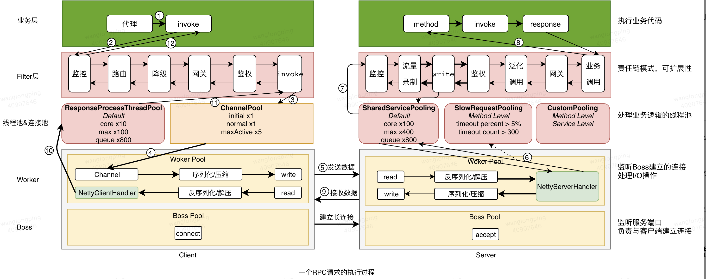
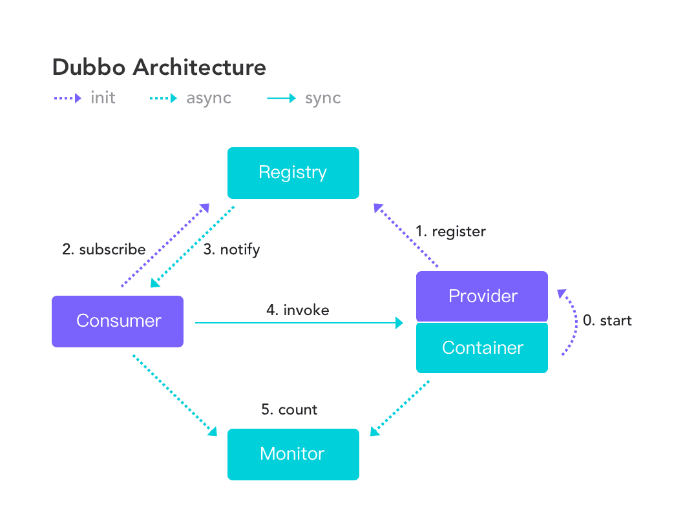

# # RPC框架学习

**RPC框架**
## RPC框架
### RPC调用过程
 
1、首先在客户端调用远程服务方法时，其真正调用的是 InvocationHandler 的 invoke 方法（这里使用 JDK 的动态代理）。Pigeon 中 InvocationHandler 的实现为 ServiceInvocationProxy， 所以调用接口声明的任意方法最终都会进到 ServiceInvocationProxy.invoke 方法。

2、ServiceInvocationProxy.invoke 中会调用客户端 Filter ，请求会依次经过 监控、路由、降级、网关、鉴权 等模块后，进入 RemoteCallInvokeFilter。

3、在  RemoteCallInvokeFilter 中调用 Client.write 方法，其逻辑为从连接池（ChannelPool）中 获取连接（获取连接的超时时间默认为：2000ms），然后将数据写进 Channel。

4、在向服务端发送数据之前，需经过 Channel 的 Pipeline（序列化、压缩等，减少网络传输的数据量）。

5、然后就开始向服务端发送数据，由于 Netty 发送消息是异步的，所以如果是同步调用的话，Pigeon 这里会让业务线程主动 await ，直到收到服务端响应或超时后唤醒。

6、服务端收到客户端发过的消息后，从 Channel 中将消息读出来之前，也会先经过一些 Pipeline（反序列化、解压缩等）后到达 NettyServerHandler，在其中 Pigeon 这边还做了服务隔离的设计：
默认的隔离机制（统计和隔离级别都是方法级的）：
 - 当超时数超过300，或者超时率超过5%，就将后续对应请求放入slow线程池处理。
 - 当超时数低于300，或者超时率低于5%，就将后续对应请求放入shared线程池处理。
 - 默认还开启方法限流（非Rhino），限制单个方法不能占用多于 380（动态控制）个线程。
提供业务自定义独立线程池的支持。

7、在选择相应的线程池并成功的拿到线程后，请求就到了服务端 Filter 中。请求会依次经过 监控、流量录制、鉴权、泛化调用、网关等模块后，进入 BusinessProcessFilter。

8、在 BusinessProcessFilter 中会根据客户端传递来的服务信息和参数，通过反射调用相应的业务服务并拿到业务处理结果。然后在 WriteResponseProcessFilter 中将返回结果写入 Channel。

9、返回结果再经过服务端的 Pipeline 处理（序列化、压缩等），就发给客户端

10、客户端收到消息后，经过客户端的 Pipeline 处理（反序列化、解压缩等）后到达 NettyClientHandler,然后交给 ResponseThreadPoolProcessor 线程池处理。

11、ResponseThreadPoolProcessor 收到消息后，会通知之前 await 的业务线程，并将结果传递给他。

12、业务线程收到 signal 通知后，就将结果返回给之前的方法调用。
###  微服务服务注册与发现
两种方式：自注册和第三方注册。 
自注册，即服务实例自行注册，是服务自身要负责注册与注销的工作。 
第三方注册，由一个独立的服务ServiceManager负责服务的注册与注销。 
服务的发现两种方式：客户端发现和第三方Router发现 
客户端发现，是指客户端自己负责发现服务节点信息，以及负载均衡的工作。这种方式最方便直接，而且也方便做负载均衡。再者一旦发现某个服务不可用立即换另外一个，非常直接。缺点也在于多语言时的重复工作，每个语言实现相同的逻辑。 

###  RPC路由管理
RPC客户端通常会去维护一个本地路由表，包含了服务方的节点地址信息。这样的好处： 
提升消费者调用性能。避免每次远程调用时，都要向注册中心查询服务方地址列表，多次创建NettyClient及连接操作。 
提高系统的可靠性。当注册中心发生不可用时，消费者可以通过缓存的地址信息和服务方进行通信。 
**路由表刷新** 
Provider正常上下线时，会主动向Registry注册中心调用register/unregister 
Consumer会订阅相关变更通知 
当注册中心数据发生变更时，会向Consumer发送通知，Consumer更新本地服务路由列表 
RPC调用时，Consumer根据路由策略从本地路由表中获取一个节点发起调用 
负载均衡是完成路由的一种实现方式，其将前端请求根据一定算法策略来分发到不同机器上。常用负载均衡策略：
RandomLoadBalance：随机负载均衡，按权重设置随机概率。 
RoundRobinLoadBalance：轮询负载均衡，按公约后的权重设置轮循比率。 
LeastActiveLoadBalance：最少活跃调用数，相同活跃数的随机。 
ConsistentHashLoadBalance：一致性哈希负载均衡，相同参数的请求总是落在同一台机器上。 
**路由故障** 
某个RPC服务端发生故障宕机，未能向注册中心调用服务下线，最终导致客户端没有刷新本地路由表，调用时就可能路由到故障节点。 
RPC客户端和服务端都工作正常，但是RPC客户端和服务端的网络发生了故障，也会引起远程调用失败。 
Q：如何解决上述链路及机器的可靠性问题，保证客户端可以及时刷新本地路由表？ 
A：目前最通用的做法就是心跳检测。 
**心跳检测机制** 
心跳检测是端对端定时发送一个心跳消息，如果连续N次心跳超时，或心跳发送失败，则判断对方下线或链路发生故障。 
RPC中的心跳： 
注册中心对服务端及客户端的心跳检测 
客户端和服务端针对链路层的心跳检测 
因为注册中心知道所有RPC客户端和服务端的实例信息，就可以通过注册中心向每个服务端和客户端发送心跳消息，检测对方是否在线。注册中心将故障节点的服务实例信息发送给客户端，由客户端将故障的服务实例信息从本地缓存的路由表中删除，后续调用不再路由到该节点。 
zookeeper临时节点实现：在zookeeper中存在持久化节点和临时节点的概念。临时节点的生命周期与zookeeper客户端会话绑定，应用连接到zookeeper时创建一个临时节点，使用长连接维持会话，当zookeeper客户端与服务端断开连接后，通过zookeeper的心跳机制，临时节点会被删除。 
对于客户端和服务端之间调用链路可靠性，可以客户端向服务端发送心跳，根据响应结果发现服务端故障或双方之间链路问题。

### 常见的RPC框架选型
必须调研了解每一种微服务的

社区活跃度

支持的语言

## Dubbo

### Dubbo调用关系说明

- 服务容器负责启动，加载，运行服务提供者。
- 服务提供者在启动时，向注册中心注册自己提供的服务。
- 服务消费者在启动时，向注册中心订阅自己所需的服务。
- 注册中心返回服务提供者地址列表给消费者，如果有变更，注册中心将基于长连接推送变更数据给消费者。
- 服务消费者，从提供者地址列表中，基于软负载均衡算法，选一台提供者进行调用，如果调用失败，再选另一台调用。
- 服务消费者和提供者，在内存中累计调用次数和调用时间，定时每分钟发送一次统计数据到监控中心。

### Dubbo服务注册与发现的流程
 
####1.节点角色说明：
Provider: 暴露服务的服务提供方。
Consumer: 调用远程服务的服务消费方。
Registry: 服务注册与发现的注册中心。
Monitor: 统计服务的调用次调和调用时间的监控中心。
Container: 服务运行容器。
####2.调用关系说明：
服务容器负责启动，加载，运行服务提供者。
服务提供者在启动时，向注册中心注册自己提供的服务。
服务消费者在启动时，向注册中心订阅自己所需的服务。
注册中心返回服务提供者地址列表给消费者，如果有变更，注册中心将基于长连接推送变更数据给消费者。
服务消费者，从提供者地址列表中，基于软负载均衡算法，选一台提供者进行调用，如果调用失败，再选另一台调用。
服务消费者和提供者，在内存中累计调用次数和调用时间，定时每分钟发送一次统计数据到监控中心。
####3.流程说明：
Provider(提供者)绑定指定端口并启动服务
指供者连接注册中心，并发本机IP、端口、应用信息和提供服务信息发送至注册中心存储
Consumer(消费者），连接注册中心 ，并发送应用信息、所求服务信息至注册中心
注册中心根据 消费 者所求服务信息匹配对应的提供者列表发送至Consumer 应用缓存。
Consumer 在发起远程调用时基于缓存的消费者列表择其一发起调用。
Provider 状态变更会实时通知注册中心、在由注册中心实时推送至Consumer

####4.Dubbo泛化调用与泛化实现原理：

简而言之，泛化调用，最最直接的表现就是服务消费者不需要有任何接口的实现，就能完成服务的调用。 
泛化引用：通常是服务调用方没有引入API包，也就不包含接口中的实体类，故服务调用方只能提供Map形式的数据，由服务提供者根据Map转化成对应的实体。 
泛化实现: 泛化实现，是指服务提供者未引入API包，也就不包含接口用于传输数据的实体类，故客户端发起调用前，需要将mode转化为Map。从上面分析，其实所谓的泛化本质上就是Map与Bean的转换。 
dubbo:servcie未配置而dubbo:reference配置了，则代表的是消费端的，必然是泛化引用。 
dubbo:servcie配置而dubbo:reference未配置了，则代表的是服务端的，必然是泛化实现

## Spring Cloud
### Spring Cloud的组件

Spring Cloud是一系列框架的有序集合。它利用 Spring Boot的开发便利性巧妙地简化了分布式系统基础设施的开发,如服务发现注册、配置中心、消息总线线、负载均衠、断路器、数据监控等,都可以用 Spring Boot的开发风格做到一键启动和部署。

它主要提供的模块包括：服务发现（Eureka），断路器（Hystrix），智能路由（Zuul），客户端负载均衡（Ribbon）等。

 Spring Cloud Eureka

Spring Cloud Gateway

Spring Cloud Gateway旨在为微服务架构提供一种简单而有效的统一的API路由管理方式。

Spring Cloud Feign

Eureka：服务注册于发现。

Feign：基于动态代理机制，根据注解和选择的机器，拼接请求 url 地址，发起请求。

Ribbon：实现负载均衡，从一个服务的多台机器中选择一台。

Hystrix：提供线程池，不同的服务走不同的线程池，实现了不同服务调用的隔离，避免了服务雪崩的问题。

Zuul：网关管理，由 Zuul 网关转发请求给对应的服务。

