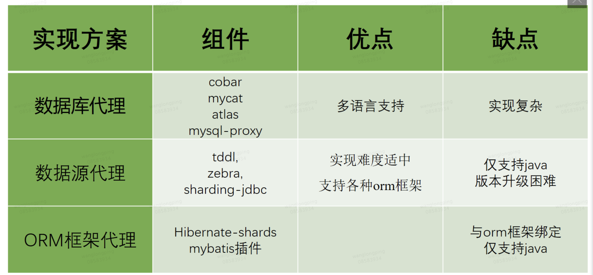

# # Mysql学习

**Spring框架**
## Mysql常见问题汇总
### 索引

MySQL索引使用的数据结构主要有BTree索引 和 哈希索引 。对于哈希索引来说，底层的数据结构就是哈希表，因此在绝大多数需求为单条记录查询的时候，可以选择哈希索引，查询性能最快；其余大部分场景，建议选择BTree索引。

MySQL的BTree索引使用的是B树中的B+Tree，但对于主要的两种存储引擎的实现方式是不同的。

MyISAM: B+Tree叶节点的data域存放的是数据记录的地址。在索引检索的时候，首先按照B+Tree搜索算法搜索索引，如果指定的Key存在，则取出其 data 域的值，然后以 data 域的值为地址读取相应的数据记录。这被称为“非聚簇索引”。
InnoDB: 其数据文件本身就是索引文件。相比MyISAM，索引文件和数据文件是分离的，其表数据文件本身就是按B+Tree组织的一个索引结构，树的叶节点data域保存了完整的数据记录。这个索引的key是数据表的主键，因此InnoDB表数据文件本身就是主索引。这被称为“聚簇索引（或聚集索引）”。而其余的索引都作为辅助索引，辅助索引的data域存储相应记录主键的值而不是地址，这也是和MyISAM不同的地方。**在根据主索引搜索时，直接找到key所在的节点即可取出数据；在根据辅助索引查找时，则需要先取出主键的值，再走一遍主索引。** 因此，在设计表的时候，不建议使用过长的字段作为主键，也不建议使用非单调的字段作为主键，这样会造成主索引频繁分裂。

MySQL中的索引可以以一定顺序引用多列，这种索引叫作**联合索引**。 
而最左前缀原则指的是，如果查询的时候查询条件精确匹配索引的左边连续一列或几列，则此列就可以被用到。
如下：

select * from user where name=xx and city=xx ; ／／可以命中索引

select * from user where name=xx ; // 可以命中索引

select * from user where city=xx ; // 无法命中索引

这里需要注意的是，查询的时候如果两个条件都用上了，但是顺序不同，如 city= xx and name ＝xx，那么现在的查询引擎会自动优化为匹配联合索引的顺序，这样是能够命中索引的。

由于最左前缀原则，在创建联合索引时，索引字段的顺序需要考虑字段值去重之后的个数，较多的放前面。ORDER BY子句也遵循此规则。

MyISAM 存储引擎的话，最多64个索引。 索引中字段字节总和不得大于 1000 bytes

Innodb 则没有什么具体的限制。

### 为什么索引能提高查询速度?
先从 MySQL 的基本存储结构说起 
MySQL的基本存储结构是页(记录都存在页里边) 
各个数据页可以组成一个双向链表 
每个数据页中的记录又可以组成一个单向链表 
每个数据页都会为存储在它里边儿的记录生成一个页目录，在通过主键查找某条记录的时候可以在页目录中使用二分法快速定位到对应的槽，然后再遍历该槽对应分组中的记录即可快速找到指定的记录 
以其他列(非主键)作为搜索条件：只能从最小记录开始依次遍历单链表中的每条记录。 
所以说，如果我们写select * from user where indexname = 'xxx'这样没有进行任何优化的sql语句，默认会这样做：

定位到记录所在的页：需要遍历双向链表，找到所在的页从所在的页内中查找相应的记录：由于不是根据主键查询，只能遍历所在页的单链表了
很明显，在数据量很大的情况下这样查找会很慢！这样的时间复杂度为O（n）。

###  简述在MySQL数据库中MyISAM和InnoDB的区别
区别于其他数据库的最重要的特点就是其插件式的表存储引擎。切记：存储引擎是基于表的，而不是数据库。

InnoDB与MyISAM的区别：

InnoDB存储引擎: 主要面向OLTP(Online Transaction Processing，在线事务处理)方面的应用，是第一个完整支持ACID事务的存储引擎(BDB第一个支持事务的存储引擎，已经停止开发)。

特点：

· 行锁设计、支持外键,支持事务，支持并发，锁粒度是支持mvcc得行级锁；

 MyISAM存储引擎: 是MySQL官方提供的存储引擎，主要面向OLAP(Online Analytical Processing,在线分析处理)方面的应用。
特点：

不支持事务，锁粒度是支持并发插入得表级锁，支持表所和全文索引。操作速度快，不能读写操作太频繁；

### 说一说脏读、不可重复读、幻读
脏读：事务A读取了事务B更新的数据，然后B回滚操作，那么A读取到的数据是脏数据；

不可重复读：事务 A 多次读取同一数据，事务 B 在事务A多次读取的过程中，对数据作了更新并提交，导致事务A多次读取同一数据时，结果因此本事务先后两次读到的数据结果会不一致；

幻读：幻读解决了不重复读，保证了同一个事务里，查询的结果都是事务开始时的状态（一致性）；

脏读:指读到了其他事务未提交的数据.

不可重复读: 读到了其他事务已提交的数据(update).

不可重复读和幻读区别：

不可重复读的重点是修改比如多次读取一条记录发现其中某些列的值被修改，幻读的重点在于新增或者删除比如多次读取一条记录发现记录增多或减少了。

不可重复读与幻读都是读到其他事务已提交的数据,但是它们针对点不同.

不可重复读:update.

幻读:delete,insert.

### union、union all的区别

对重复结果的处理：UNION在进行表链接后会筛选掉重复的记录，Union All不会去除重复记录；

对排序的处理：Union将会按照字段的顺序进行排序；UNION ALL只是简单的将两个结果合并后就返回；

从效率上说，UNION ALL 要比UNION快很多

### 事务的隔离级别有哪些?

READ-UNCOMMITTED(读取未提交)： 最低的隔离级别，允许读取尚未提交的数据变更，可能会导致脏读、幻读或不可重复读。

READ-COMMITTED(读取已提交)： 允许读取并发事务已经提交的数据，可以阻止脏读，但是幻读或不可重复读仍有可能发生。

REPEATABLE-READ(可重复读)： 对同一字段的多次读取结果都是一致的，除非数据是被本身事务自己所修改，可以阻止脏读和不可重复读，但幻读仍有可能发生。

SERIALIZABLE(可串行化)： 最高的隔离级别，完全服从ACID的隔离级别。所有的事务依次逐个执行，这样事务之间就完全不可能产生干扰，也就是说，该级别可以防止脏读、不可重复读以及幻读。

RR, 如何实现可重复读？
1.在快照读读情况下，mysql通过mvcc来避免幻读。

2.在当前读读情况下，mysql通过next-key来避免幻。

MVCC(多版本并发控制)
在InnoDB中，会在每行数据后添加两个额外的隐藏的值来实现MVCC，这两个值一个记录这行数据何时被创建，另外一个记录这行数据何时过期（或者被删除）。 在实际操作中，存储的并不是时间，而是事务的版本号，每开启一个新事务，事务的版本号就会递增。

MCVV这种读取历史数据的方式称为快照读(snapshot read),而读取数据库当前版本数据的方式,叫当前读(current read).

我们平时只用使用select就是快照读,这样可以减少加锁所带来的开销.

对于会对数据修改的操作(update、insert、delete)都是采用当前读的模式。在执行这几个操作时会读取最新的记录，即使是别的事务提交的数据也可以查询到。假设要update一条记录，但是在另一个事务中已经delete掉这条数据并且commit了，如果update就会产生冲突，所以在update的时候需要知道最新的数据。读取的是最新的数据，需要加锁。

Next-Key锁

### mysql的MVCC机制

MVCC是一种多版本并发控制机制，是MySQL的InnoDB存储引擎实现隔离级别的一种具体方式，用于实现提交读和可重复读这两种隔离级别。MVCC是通过保存数据在某个时间点的快照来实现该机制，其在每行记录后面保存两个隐藏的列，分别保存这个行的创建版本号和删除版本号，然后Innodb的MVCC使用到的快照存储在Undo日志中，该日志通过回滚指针把一个数据行所有快照连接起来。

### insert into & insert ignore into & replace into的区别

## 分库分表相关问题汇总
### 为什么要分库分表（设计高并发系统的时候，数据库层面应该如何设计）？

**为什么要分库？**

按一般的经验来说，一个单库最多支持并发量到2000，且最好保持在1000。如果有20000并发量的需求，这时就需要扩容了，可以将一个库的数据拆分到多个库中，访问的时候根据一定条件访问单库，缓解单库的性能压力。

**为什么要分表？**

分表也是一样的，如果单表的数据量太大，就会影响SQL语句的执行性能。分表就是按照一定的策略将单表的数据拆分到多个表中，查询的时候也按照一定的策略去查询对应的表，这样就将一次查询的数据范围缩小了。比如按照用户id来分表，将一个用户的数据就放在一个表中，crud先通过用户id找到那个表在进行操作就可以了。这样就把每个表的数据量控制在一定范围内，提升SQL语句的执行性能。

### 分库分表的常见实现方案

客户端代理： 分片逻辑在应用端，封装在jar包中，通过修改或者封装JDBC层来实现。 当当网的 Sharding-JDBC 、阿里的TDDL是两种比较常用的实现。
中间件代理： 在应用和数据中间加了一个代理层。分片逻辑统一维护在中间件服务中。 我们现在谈的 Mycat 、360的Atlas、网易的DDB等等都是这种架构的实现。

### 分库分表之后,id 主键如何处理？

UUID：不适合作为主键，因为太长了，并且无序不可读，查询效率低。比较适合用于生成唯一的名字的标示比如文件的名字。

数据库自增 id : 两台数据库分别设置不同步长，生成不重复ID的策略来实现高可用。这种方式生成的 id 有序，但是需要独立部署数据库实例，成本高，还会有性能瓶颈。

利用 redis 生成 id : 性能比较好，灵活方便，不依赖于数据库。但是，引入了新的组件造成系统更加复杂，可用性降低，编码更加复杂，增加了系统成本。

Twitter的snowflake算法 ：Github 地址：https://github.com/twitter-archive/snowflake。

美团的Leaf分布式ID生成系统 ：Leaf 是美团开源的分布式ID生成器，能保证全局唯一性、趋势递增、单调递增、信息安全，里面也提到了几种分布式方案的对比，但也需要依赖关系数据库、Zookeeper等中间件。

###  分布式事务处理方式？

CAP理论

一致性（C）：在分布式系统中的所有数据备份，在同一时刻是否同样的值。（等同于所有节点访问同一份最新的数据副本）

可用性（A）：在集群中一部分节点故障后，集群整体是否还能响应客户端的读写请求。（对数据更新具备高可用性）

分区容忍性（P）：以实际效果而言，分区相当于对通信的时限要求。系统如果不能在时限内达成数据一致性，就意味着发生了分区的情况。

一个分布式系统不可能同时满足C(一致性)、A(可用性)和P(分区容错性)。由于分区容错性在是分布式系统中必须要保证的，因此我们只能在A和C之间进行权衡。

Paxos 算法

Raft算法

###   分库分表迁移

双写部署法

###   分库分表实现读写分离原理
1、什么是读写分离

读写分离，基本的原理是让主数据库处理事务性增、改、删操作（INSERT、UPDATE、DELETE），而从数据库处理SELECT查询操作。数据库复制被用来把事务性操作导致的变更同步到集群中的从数据库。

2、为什么要读写分离呢？

因为数据库的“写”（写10000条数据到oracle可能要3分钟）操作是比较耗时的。

但是数据库的“读”（从oracle读10000条数据可能只要5秒钟）。

所以读写分离，解决的是，数据库的写入，影响了查询的效率。

3、什么时候要读写分离？

数据库不一定要读写分离，如果程序使用数据库较多时，而更新少，查询多的情况下会考虑使用，利用数据库 主从同步 。可以减少数据库压力，提高性能。当然，数据库也有其它优化方案。memcache 或是 表折分，或是搜索引擎。都是解决方法。

4.主从复制、读写分离的基本设计

在实际的生产环境中，对数据库的读和写都在同一个数据库服务器中，是不能满足实际需求的。无论是在安全性、高可用性还是高并发等各个方面都是完全不能满足实际需求的。因此，通过主从复制的方式来同步数据，再通过读写分离来提升数据库的并发负载能力。

一台主、多台从，主提供写操作，从提供读操作。

读写分离的实现：

我们只需要实现读写分离，主从复制数据一般由数据库级来实现同步，当然也可以自己去实现同步，只是需要考虑的点比较多。

###   分库分表分页问题

第三种:采取的是基于业务的模式:迫使用户无法进行跳页查询,什么意思呢,就是用户只能点击下一页或者上一页的方式浏览,具体的做法在于查询得到记录数的同时记录下当前唯一id值的最大值,然后再次查询的时候添加where 条件…让我们从头开始捋: 第一次查询pageNum=1,pageSize=10 ,maxId=0->sql:select * from db_x where id>0 limit 10; 然后分发到对应的库的表中,将得到的4*10条数据合并,再在内存中进行解析排序,取前10条数据,同时将第10条数据的id=maxId单独取出渲染到前端页面上保存,这样当点击下一页的时候,这个maxId=10也提交上去了,sql 变成了select * from db_x where id>10 limit 10,然后继续解析,继续保存…这种方式返回的数据都是稳定的并且数据是连贯的(排序)

第四种：
1):我们先记录下要查询的记录数的范围:(1001-1)*10=10000 开始,10010结束->10000-10010
单体的sql为:select * from db limit 10000,10;
我们总共有4个表,意味着:每个表的start应该为10000/4=2500,从而sql变成了:
select * from db_x limit 2500,10;	//假设是平均分配的,因而我们可以均分,不均分也没关系,后续操作会补齐
我们会得到4个表中的记录:(因为我demo还没写,所以先手写了)
T1:(1,"a"),.......
T2:(2,"b"),.......
T3:(3,"c"),.......
T4:(4,"d"),.......
真实数据第1001页不可能是1开头的,将就着看吧,过几天会一起讲rabbitMQ分布式一致性和这个demo一起发布的
ok,第一阶段的sql查询结束

2):对4个表中返回的记录进行id匹配(id如果非整型,自行用hashCode匹配),因为是升序查询,所以我们只需要比较下每个表的首条记录的id值即可,获得了最小的minId=1,和各个表最大的那个值maxId;ok,转换sql思路,这里我们采用条件查询了(弥补操作第一步):
select * from db_x where id between minId and maxId 这样我们就获取到了遗漏的数据(当然有多余的数据)
这样我们4个表中就返回了可能记录数各不相同的记录,第二步结束

3):
之后记录minId出现的位置,如T1出现的位置为2500,T2出现的位置为2500-2=2048 ,T3出现的位置为2500-3=2047 ,T4出现的位置为2500-3=2047 则最终出现的记录数为:2500+2048+2047+2047=10000-2-3-3=9992,因此我们需要的查询的记录数需要从9992 依次往后取8个开始,然后再取10个就是所求的数据,这种方式能做到数据精确查询,但是唯一的缺点就是每次查询都需要进行二次sql查询
第三种方式不支持跳页,但是相比而言是更简洁的一种方式,最后一种方式的唯一缺陷在于需要查询两次sql,最终项目的选择本人还是推荐第一种>第四总>第三种的.

###   数据库分库分表原理
支付宝的原理，在jdbc层生成切分后，生成动态sql, 匹配不同库表，结果集join

### 主键生成
snowflake算法：时间+businessIdx+机房+机器+step

### 分库分表跨表查询数据

### 读写分离的原理及优点

服务端代理(proxy：代理数据库)中： 
      我们独立部署一个代理服务，这个代理服务背后管理多个数据库实例。而在应用中，我们通过一个普通的数据源(c3p0、druid、dbcp等)与代理服务器建立连接，所有的sql操作语句都是发送给这个代理，由这个代理去操作底层数据库，得到结果并返回给应用。在这种方案下，分库分表和读写分离的逻辑对开发人员是完全透明的。
 
 客户端代理(datasource：代理数据源)： 
      应用程序需要使用一个特定的数据源，其作用是代理，内部管理了多个普通的数据源(c3p0、druid、dbcp等)，每个普通数据源各自与不同的库建立连接。应用程序产生的sql交给数据源代理进行处理，数据源内部对sql进行必要的操作，如sql改写等，然后交给各个普通的数据源去执行，将得到的结果进行合并，返回给应用。数据源代理通常也实现了JDBC规范定义的API，因此能够直接与orm框架整合。在这种方案下，用户的代码需要修改，使用这个代理的数据源，而不是直接使用c3p0、druid、dbcp这样的连接池。
      
  主流的数据库中间件实现对比
  
   
   
   数据库代理

    目前的实现方案有：阿里巴巴开源的cobar，mycat团队在cobar基础上开发的mycat，mysql官方提供的mysql-proxy，奇虎360在mysql-proxy基础开发的atlas。目前除了mycat，其他几个项目基本已经没有维护。

    优点：多语言支持。也就是说，不论你用的php、java或是其他语言，都可以支持。原因在于数据库代理本身就实现了mysql的通信协议，你可以就将其看成一个mysql 服务器。mysql官方团队为不同语言提供了不同的客户端驱动，如java语言的mysql-connector-java，python语言的mysql-connector-python等等。因此不同语言的开发者都可以使用mysql官方提供的对应的驱动来与这个代理服务器建通信。

     缺点：实现复杂。因为代理服务器需要实现mysql服务端的通信协议，因此实现难度较大。

数据源代理

    目前的实现方案有：阿里巴巴开源的tddl，大众点评开源的zebra，当当网开源的sharding-jdbc。需要注意的是tddl的开源版本只有读写分离功能，没有分库分表，且开源版本已经不再维护。大众点评的zebra开源版本代码已经很久更新，基本上处于停滞的状态。当当网的sharding-jdbc目前算是做的比较好的，代码时有更新，文档资料比较全。

     优点：更加轻量，可以与任何orm框架整合。这种方案不需要实现mysql的通信协议，因为底层管理的普通数据源，可以直接通过mysql-connector-java驱动与mysql服务器进行通信，因此实现相对简单。

     缺点：仅支持某一种语言。例如tddl、zebra、sharding-jdbc都是使用java语言开发，因此对于使用其他语言的用户，就无法使用这些中间件。版本升级困难，因为应用使用数据源代理就是引入一个jar包的依赖，在有多个应用都对某个版本的jar包产生依赖时，一旦这个版本有bug，所有的应用都需要升级。而数据库代理升级则相对容易，因为服务是单独部署的，只要升级这个代理服务器，所有连接到这个代理的应用自然也就相当于都升级了。

ORM框架代理

        目前有hibernate提供的hibernate-shards，也可以通过mybatis插件的方式编写。相对于前面两种方案，这种方案可以说是只有缺点，没有优点。  
        
    
  优点
避免单点故障。

负载均衡，读能力水平扩展。通过配置多个slave节点，可以有效的避免过大的访问量对单个库造成的压力。

